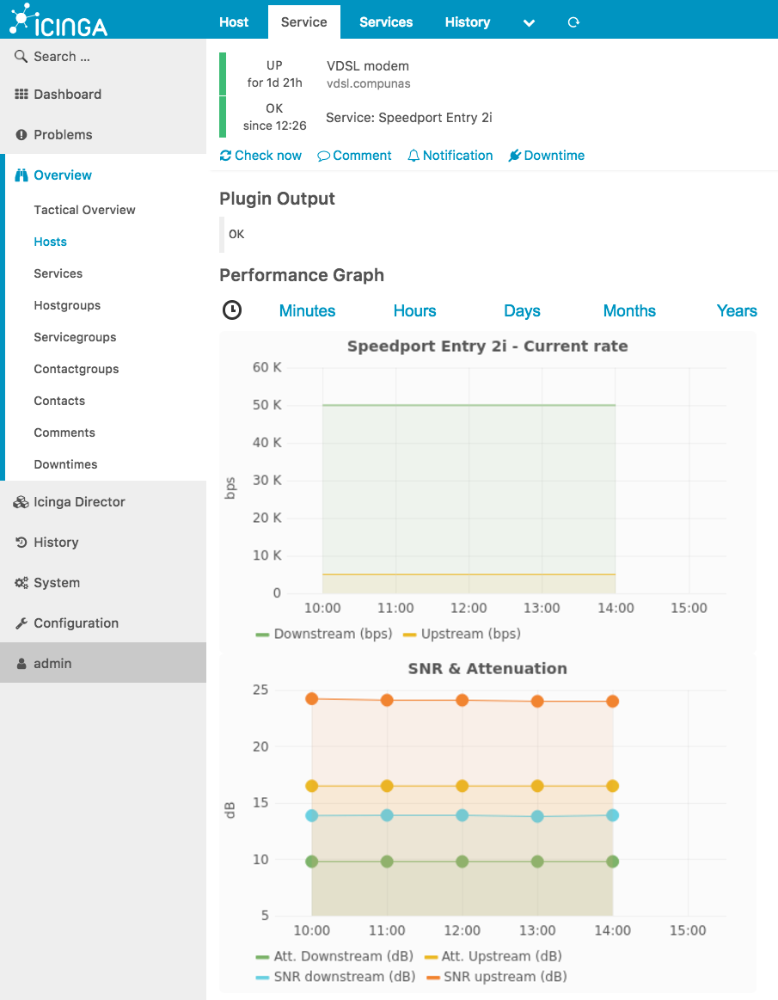
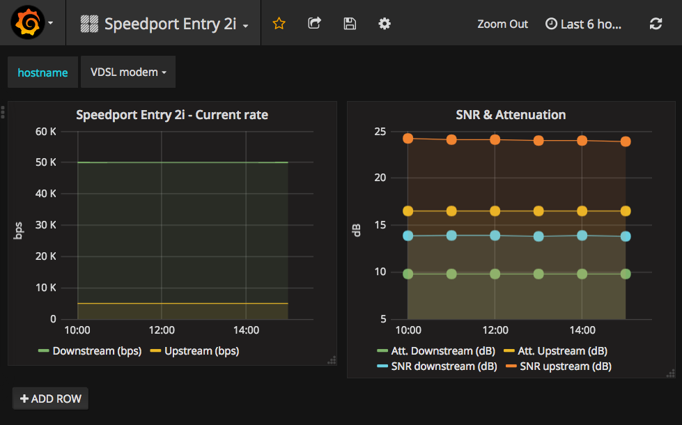
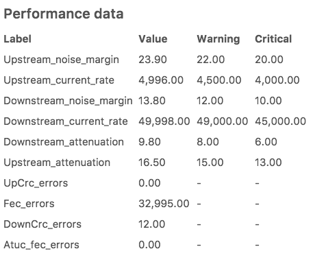
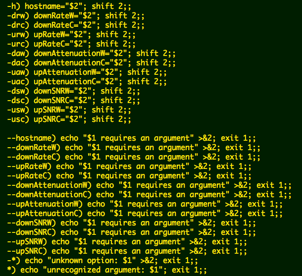

# Speedport Entry 2i monitor

An Icinga2 (*et al*) check plugin with an accompanying Grafana dashboard for Speedport Entry 2i. This is the one of the default CPEs my Internet provider uses and comes with absolutely no way to remotely monitor it via SNMP or other mechanism. The plugin is a Bash script and requires `bc` to operate.

## Screenshots
### Icinga with embedded Grafana dashboard

### Grafana

## Parameters reported

## Paremeters threshold
